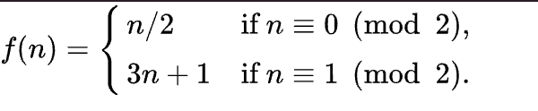
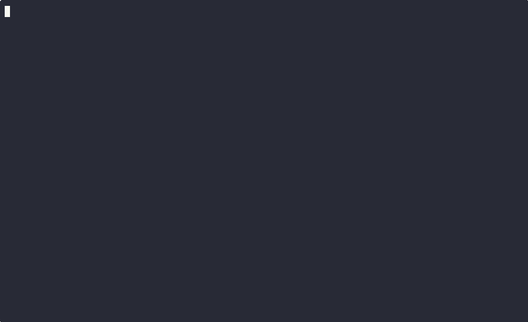

# 51042 - Programming Assignment 0

This homework is shorter than most, we still recommend starting early so that if you run into setup issues you have plenty of time to speak to course staff.

Goals:

- Ensure you have a working development environment.
- Familiarize yourself with the course software: uv, pytest, GitHub, Gradescope.
- Gain practice writing short Python functions.

## Part 0. Setup

1. If you haven't set up your environment yet, see [Using uv](https://python.tylerskluzacek.com/guides/uv/) from the course site to get started.
    While you are always free to develop in a setup of your choosing, but due to the infinite possible variations stemming from different operating systems, versions of Python, etc. we will not be able to provide support for issues you may run into specific to your local environment.
2. If you haven't already gotten set up with GitHub, you'll need to follow the steps at [Git Basics](https://uchicago-cs.github.io/student-resource-guide/tutorials/git-basics.html) from the UChicago CS Student Resource Guide.
3. Every assignment will begin with the same process, follow the steps at [checking out an assignment](https://python.tylerskluzacek.com/coursework/programming/#checking-out-an-assignment).
4. Once you have the assignment cloned locally, run `uv sync` from within the assignment directory. This will install the necessary libraries.

## Working on the Assignment

This assignment is comprised of four short problems, you may complete them in any order.

For each assignment you will be writing some Python, take some time on this first assignment to read through the 
[style guide](https://uchicago-cs.github.io/student-resource-guide/style-guide/python.html).

Writing readable code is important, and this guide is a significant portion of our grading.

You may use a linter such as `ruff` to assist you, but be sure to follow documentation and variable naming rules, which linters typically cannot help with.

### Running `pytest`

Each problem comes with some helpful tests.
These are not guaranteed to be comprehensive, it may benefit you to consider other cases as well.

You can run `uv run pytest` from this directory to run all tests for the homework.

To just run a subset of tests, you can specify the directory name, e.g. `uv run pytest collatz`.

See [pytest tips on the course site](https://python.tylerskluzacek.com/coursework/programming/#pytest-tips) for helpful tips.

**Remember, you will be using these tools a lot, taking a few minutes to learn them on this first assignment will be worth your time.**

## Problems

### Problem 1

Open `palindromes/palindromes.py`. You will see a function that has a docstring describing its behavior but no implementation.

Your job is to finish that function to the given specification.

There are two ways to test your code for this problem:

The typical way, which you'll use for most problems: `uv run pytest palindromes/` -- this tells `pytest` to execute all tests in `palindromes`.
We'll discuss this further in class, but tests are functions named `test_*` that exist in files with the same pattern. Open up `test_palindromes.py` to see what this looks like.
**Future tests will usually not be this simple, so it would be a good time to learn what a minimal test looks like.**

You can also use `uv run palindromes/palindromes.py mom cat wow` (replacing the words with any words you choose)
this executes the 'main' function which we have provided. You can change the provided words on the command line to try different sets.
This is provided as an example of how you might choose to test your own code, you might consider writing similar functions in the future.

### Problem 2

Open `stripes/stripes.py` and complete `make_stripes` per the specification.

This time, tests can be run via `uv run pytest stripes/`

There is also a command line interface you can try, for example: `uv run stripes/stripes.py 4 horizontal`.

### Problem 3

The Collatz conjecture is a famous unsolved problem in math that asks if the function

converges on 1 for all initial values of n.

(Source: https://en.wikipedia.org/wiki/Collatz_conjecture)

We're going to implement two functions that will allow us to test given values of n.

Open `collatz/collatz.py`, implement the two functions.

Tip: Keep the difference between `/` and `//` in mind.

Reference: <https://docs.python.org/3/glossary.html#term-floor-division>

To run these tests you can run `uv run pytest collatz`

### Problem 4

This problem has you using loops and conditionals to draw a simple "ASCII art" plant.

The final output will look like this:

You will need to complete the function `make_plant` in `plants/plants.py`.
The docstring will tell you what the function should return.

A few tips:

- Notice that there is a space at the beginning of lines that do not have leaves.
- Remember that the "\n" character creates a new line within a string.
- Your function must **return** a string.

You can test your code with `uv run pytest plants`

You can see the animation once you've completed the function by running `uv run python plants/plants.py`.

### About Testing and Grading

Gradescope will grade your submission **only** by running automated tests.
- Printed output does not affect the 'completeness' portion of your grade (only returned values do). 
- The provided `main()` functions and command-line interfaces are for **your own testing only**.
- Your functions must return the correct values as specified.
